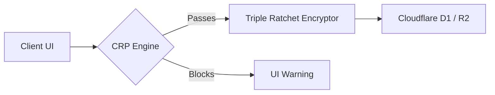

# Whispr 🛡️

**Constitutional Secure Messaging with Post-Quantum Cryptography**

[](https://opensource.org/licenses/MIT)
[](https://workers.cloudflare.com/)
[](https://reactjs.org/)

Whispr is a serverless, end-to-end encrypted messaging platform that enforces a **Constitutional AI Layer**. It guarantees complete privacy from the server while physically preventing the transmission of harmful or abusive content through zero-knowledge algorithmic text evaluation.

---

## 🌟 Key Features

* **Real-time Constitutional AI**: Client-side semantic/pattern analysis runs in an isolated Web Worker *before* encryption. Messages violating human safety principles (e.g., violence, CSAM, doxxing) are blocked out-of-the-box.
* **Blind Server Architecture**: The backend relies on opaque mailboxes. No social graphs are constructed. The server stores encrypted blobs and drops them based on ephemeral flags.
* **PQXDH Key Exchange**: Hybrid Post-Quantum Key Exchange combining X25519 and ML-KEM-768 for future-proof security against harvest-now-decrypt-later attacks.
* **Triple Ratchet (SPQR)**: Forward secrecy and post-compromise security via a dual DH + KEM ratchet synchronized by Lamport clocks.
* **Convergent Media Encryption**: Zero-knowledge deduplication of images and media.
* **Zero Infrastructure Overhead**: 100% serverless, designed to run entirely on the Cloudflare Free Tier (Workers + D1 + KV + R2 + Durable Objects).

---

## 🏗️ Architecture

Whispr has no monolithic backend. Instead, it delegates security completely to the endpoints.

1. **Client**: A React 18 / Material 3 app utilizing memory-shredded Web Workers for Argon2id Key Derivation, PQXDH, and CRP pipeline enforcement.
2. **Server**: Cloudflare Hono routes combined with `ConversationRoom` and `QuotaLedger` Durable Objects.



---

## 🚀 Getting Started

### Local Development

1. **Clone the repository**:
   ```bash
   git clone https://github.com/R2RSpace/whispr.git
   cd whispr
   ```

2. **Install dependencies**:
   ```bash
   npm install
   ```

3. **Initialize Local Database**:
   ```bash
   npm run db:init
   ```

4. **Start Development Server**:
   ```bash
   npm run dev
   # Runs Vite (Port 5173) alongside Wrangler API Proxy (Port 8787)
   ```

### Production Deployment (Cloudflare)

Whispr doesn't need traditional servers. It runs natively on the Cloudflare Edge network. 

1. Install and authenticate `wrangler`:
   ```bash
   npm install -g wrangler
   wrangler login
   ```
2. Provision resources:
   ```bash
   wrangler d1 create whispr-db
   wrangler kv namespace create WHISPR_KV
   wrangler r2 bucket create whispr-media 
   ```
3. Update `wrangler.toml` with the IDs generated from the steps above.
4. Deploy the full stack:
   ```bash
   npm run deploy
   ```

---

## 📜 The Constitution

Whispr is governed by `constitution.json`. It defines 8 core principles:
- **P1**: Non-Violence (BLOCK)
- **P2**: Child Safety (BLOCK)
- **P3**: Epistemic Clarity (WARN)
- **P4**: Anti-Harassment (BLOCK)
- **P5**: Anti-Discrimination (WARN)
- **P6**: Privacy Sovereignty (ANNOTATE)
- **P7**: Autonomy Preservation (ANNOTATE)
- **P8**: Self-Harm Prevention (ANNOTATE)

Community administrators can hot-reload these principles via the Constitution API.

---

## 🛡️ Security Posture

Whispr implements **20 targeted security patches**, including:
* **OPRF Key Verification**: Prevents offline dictionary attacks on captured databases by requiring server-side blind participation in key derivation.
* **Tiered Padding**: Eliminates side-channel fingerprinting based on ciphertext size variations.
* **Race-Condition-Free Quota Management**: Utilizes Cloudflare Durable Objects to guarantee serialized I/O.
* **Memory Shredding**: Sensitive materials inside Web Workers are securely overwritten (`typedArray.fill(0)`) rather than waiting for Garbage Collection.

---

*Whispr: Because privacy and safety are not opposites. They are partners.*
